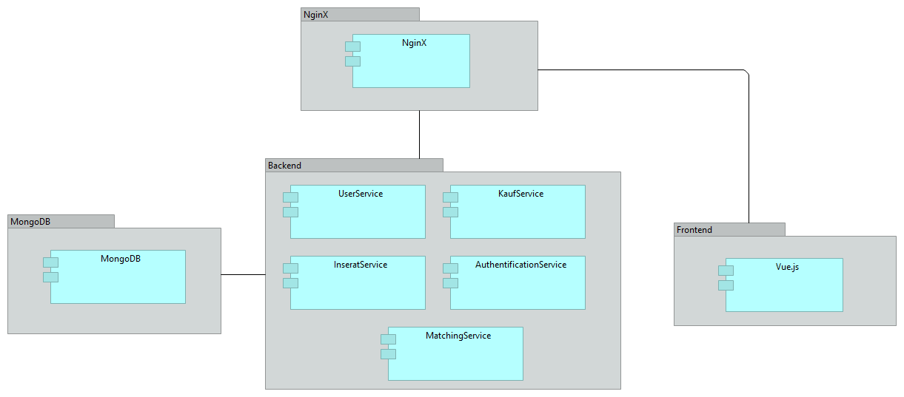

# DEC SpiritAnimal (Team 0204)

  
Mit SpiritAnimal wird die Suche nach dem perfekten neuen Haustier zum Spaß für Alt und Jung!
## Local Deployment
**MongoDB** Container starten per `docker compose up`  
*MongoExpress Datenbankfrontend erreichbar über `localhost:8081`*

**Backend** mit Maven builden lassen und über IDE starten

**Frontend**: Nach `\implementation\frontend\spiritanimal-frontend` navigieren.  
`npm i`  
`npm run serve`

## Tech-Stack
Datenbank: MongoDB  
Backend: Java/Spring Boot  
Frontend: Vue.js  
Deployment: Docker

## System-Architektur

Über NginX wird die SSL-Verschlüsselung sichergestellt. Ansonsten orientiert sich der Aufbau des Systems am MVC-Ansatz (Model-View-Controller).

## Use Cases
Implementieurng der Use Cases:

| Use Case ID | Name          |
|-------------|---------------|
| UC1         | Jonas Speiser |
| UC2         | Vincent König |
| UC3         | Vincent König |
| UC4         | Vincent König |
| UC5         | Jonas Speiser |
| UC6         | Jonas Speiser |

### UC1: User erstellen/Login (B2C/B2B)
**B2C-User** loggen sich einfach über das Frontend nach erfolgreicher Registrierung mit Username und Passwort ein.  
**B2B-User** registrieren sich auch zunächst über das Frontend. Anschließend können sie mit einem Klick auf die Schaltfläche "Mein Profil" ihren API-Token kopieren.
Dieser Token ist bei allen API-Calls im Header mitzugeben.  
Für den **Administrator** des Systems gibt es einen bereits angelegten Account mit bereits hinterlegtes Passwort:  

Username: admin  
Passwort: admin

Der Administrator erhält seinen API-Token genau wie der B2B User, indem er ihn unter "Mein Profil" kopiert.  
Ist ein Token abgelaufen, muss der User sich wieder übers Frontend einloggen um wiederum seinen neuen Token zu kopieren.

### UC2: Soulsearch/Matching (B2C)
**B2C-User** können unter "SoulSearch" ihren animalischen Seelenverwandten finden, indem sie - ähnlich wie bei gängigen Dating-Apps - durch Inserate navigieren. Dies geschieht entweder über ein "Like", was das Inserat der "My Darlings"-Liste hinzufügt, oder ein "Dislike", welches dem User in weiterer Folge auch nicht mehr angezeigt wird.

### UC3: Inserat erstellen (B2C/B2B)
**B2C-User** können über die Website unter "Inserieren" einfach ein neues Inserat erstellen und ihre Inserate unter "Meine Inserate" einsehen, bearbeiten und löschen.
**B2B-User** können dies über eine Schnittstelle tun, indem ein entsprechender POST/DELETE/PUT-Request an eine API geschickt wird.

### UC4: Kauf von Premium-Funktionen (B2B)
**B2B-User** können ihrem Inserat den Status "PREMIUM" über einen entsprechenden PATCH-Request an eine API verpassen.

### UC5: Kauf eines Tiers (B2C)

### UC6: Stornierung eines Kaufs (B2C)

