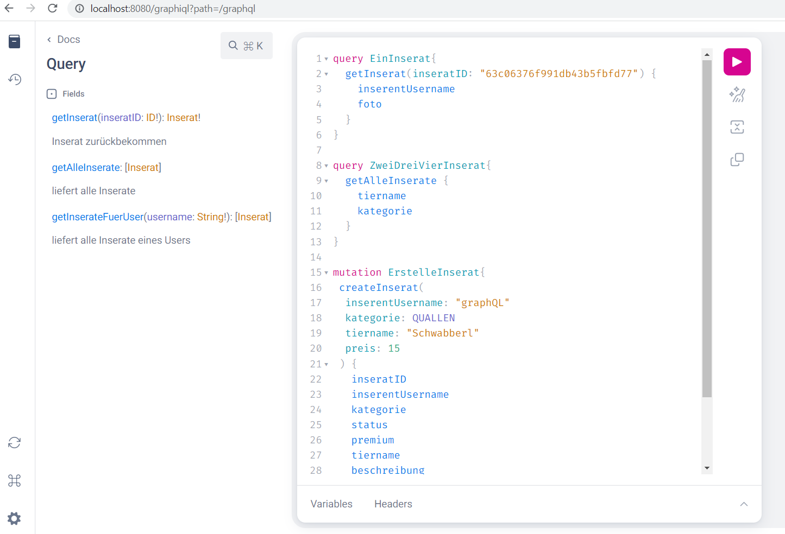

# DEC SpiritAnimal (Team 0204)

  
Mit SpiritAnimal wird die Suche nach dem perfekten neuen Haustier zum Spaß für Alt und Jung!
## Table of Content
1. [Deployment](#deployment)
   1. [Docker](#docker)
   2. [Endpoints](#endpoints)
2. [Tech-Stack](#tech-stack)
3. [System-Architektur](#system-architektur)
4. [Use Cases](#use-cases)
   1. [UC1: User erstellen/Login (B2C/B2B)](#uc1-user-erstellenlogin-b2cb2b)
   2. [UC2: Soulsearch/Matching (B2C)](#uc2-soulsearchmatching-b2c)
   3. [UC3: Inserat erstellen (B2C/B2B)](#uc3-inserat-erstellen-b2cb2b)
   4. [UC4: Kauf von Premium-Funktionen (B2B)](#uc4-kauf-von-premium-funktionen-b2b)
   5. [UC5: Kauf eines Tiers (B2C)](#uc5-kauf-eines-tiers-b2c)
   6. [UC6: Stornierung eines Kaufs (B2C)](#uc6-stornierung-eines-kaufs-b2c)
   7. [Zusätzlicher Usecase: Admin Funktionalität](#zustzlicher-usecase-admin-funktionalitt)
5. [Postman Collection](#postman-collection)
6. [GraphQL Schnittstelle](#graphql-schnittstelle)

## Deployment 
### Docker

- `docker compose build`
- `docker compose up`  

### Endpoints:
- Frontend erreichbar über: `https://localhost:443/`
- API erreichbar über: `https://localhost:443/api/`
- Die weiteren API-Routen finden sich in der Postman Collection
- Es ist zwar nicht "offizieller" Teil der Abgabe, sollten Sie sich aber für die Datenbank im Hintergrund interessieren, ist Mongo Express erreichbar über: `http://localhost:8081`
## Tech-Stack
- Datenbank: MongoDB  
- Backend: Java/Spring Boot  
- Frontend: Vue.js  
- Deployment: Docker

## System-Architektur

Über NginX wird die SSL-Verschlüsselung sichergestellt. Ansonsten entspricht das System einem modularen Monolithen und orientiert sich am MVC-Ansatz (Model-View-Controller).

## Use Cases
Dies soll nur als kurze Übersicht dienen, eine ausführliche Beschreibung der Use Cases findet sich in Abgabe 2. 
Implementierung der Use Cases:

| Use Case ID | Name          |
|-------------|---------------|
| UC1         | Jonas Speiser |
| UC2         | Vincent König |
| UC3         | Vincent König |
| UC4         | Vincent König |
| UC5         | Jonas Speiser |
| UC6         | Jonas Speiser |

### UC1: User erstellen/Login (B2C/B2B)
**B2C-User** loggen sich einfach über das Frontend nach erfolgreicher Registrierung mit Username und Passwort ein.  
**B2B-User** registrieren sich auch zunächst über das Frontend. Anschließend können sie mit einem Klick auf die Schaltfläche "Mein Profil" ihren API-Token kopieren.
Dieser Token ist bei allen API-Calls im Header mitzugeben.  
Für den **Administrator** des Systems gibt es einen bereits angelegten Account mit bereits hinterlegtes Passwort:  

Username: admin  
Passwort: admin

Der Administrator erhält seinen API-Token genau wie der B2B User, indem er ihn unter "Mein Profil" kopiert.  
Ist ein Token abgelaufen, muss der User sich wieder übers Frontend einloggen um wiederum seinen neuen Token zu kopieren.

User könen auch batchmäßig angelegt werden.

### UC2: Soulsearch/Matching (B2C)
**B2C-User** können unter "SoulSearch" ihren animalischen Seelenverwandten finden, indem sie - ähnlich wie bei gängigen Dating-Apps - durch Inserate navigieren. Dies geschieht entweder über ein "Like", was das Inserat der "My Darlings"-Liste hinzufügt, oder ein "Dislike", welches dem User in weiterer Folge auch nicht mehr angezeigt wird.

### UC3: Inserat erstellen (B2C/B2B)
**B2C-User** können über die Website unter "Inserieren" einfach ein neues Inserat erstellen und ihre Inserate unter "Meine Inserate" einsehen, bearbeiten und löschen.
**B2B-User** können dies über eine Schnittstelle tun, indem ein entsprechender POST/DELETE/PUT-Request an eine API geschickt wird. Anlegen und Ändern geht auch über Batch-Input.

### UC4: Kauf von Premium-Funktionen (B2B)
**B2B-User** können ihrem Inserat den Status "PREMIUM" über einen entsprechenden PATCH-Request an eine API verpassen. Auch dies geht über Batch-Input.

### UC5: Kauf eines Tiers (B2C/B2B)
**B2C-User** können über die Website unter "MyDarlings" ihre favorisierten Tiere betrachten. Dort haben sie die Möglichkeit, 
per Klick auf einen Button das jeweilige Tier zu kaufen.
**B2B-User** können dies wiederum über die API tun, indem sie zunächst einen GET-Request an /api/inserate schicken, 
um aus diesen die inseratIDs zu übernehmen, welche von Interesse sind. Diese können mit einem POST-Request auf /api/kaeufe/batch gekauft werden.  

Bei einem Kauf werden im Hintergrund zunächst eine Zahlung bei einem (gemockten) PaymentProvider ausgelöst. 
Ist dies geschehen, muss der Anbieter des Tieres zunächst die Kaufanfrage bestätigen damit der Kauf ausgelöst wird. 
Dies ist über das Anfragencenter des Frontends oder für B2B User per POST auf /api/kaeufe/akzeptieren möglich. 
Sämtliche Kaufanfragen kann er hierfür über GET /api/kaeufe?anbieter einsehen.

### UC6: Stornierung eines Kaufs (B2C/B2B)
**B2C-User** können über die Website unter "Meine Käufe" sämtliche getätigten Käufe einsehen. Dort können sie auch per Button-Klick widerrufen werden.
Befindet sich das Tier bereits beim Käufer, muss zunächst der Anbieter die erfolgte Rückgabe des Tieres bestätigen bevor das Geld über den (gemockten) PaymentProvider zurückerstattet wird.
**B2B-User** können per POST auf /api/kaeufe/widerruf/batch Widerrufe für beliebig viele Käufe starten. Die hierfür notwendigen kaufIDs erhalten sie über GET /api/kauefe?kaeufer.

### Zusätzlicher Usecase: Admin Funktionalität

Wenn man sich als admin (user admin/password admin) einloggt, erscheint im Menü "Mein Profil" (wo auch die Information zum Token gespeichert ist) ein Button, der zum "Admin Space" führt. Dies ist ein Dashboard, wo der Admin zentral alle User, Inserate und Käufe einsehen kann. Darüber hinaus kann der Admin hier auch einzelne Inserate und Käufe löschen.

## Postman Collection

Die Postman Collection `DEC.postman_collection.json` umfasst alle wesentlichen Funktionalitäten und kann prinzipiell von oben nach unten "durchgespielt" werden. Für die Authentifizierung ist es jedoch wichtig, dass man - je nach Vorgang - mit dem "richtigen" User eingeloggt ist - hierfür muss bei den Variables in der Collection der Token hinterlegt werden, der nach dem POST-Request "Login/Get API Token" übermittelt wurde (da jeder User einen eigenen Token hat). Ist dieser Token hier einmal hinterlegt, werden alle weiteren Requests automatisch mit diesem Token (ergo User) ausgeführt:  

  

## GraphQL Schnittstelle
Die GraphQL Schnittstelle lässt sich am einfachsten über das graphiql-Interface testen. Dort findet sich auch direkt deren Dokumentation.
Dieses ist erreichbar über `localhost:8080/graphiql`. 

